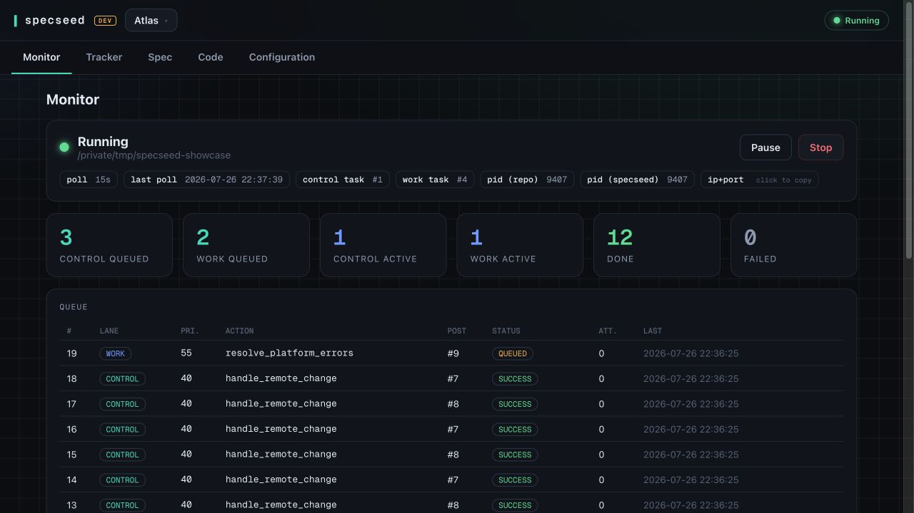
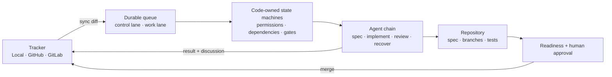
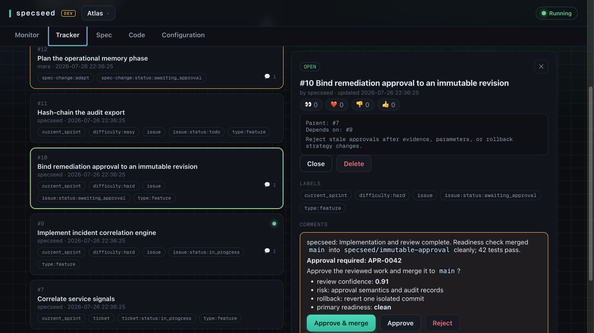
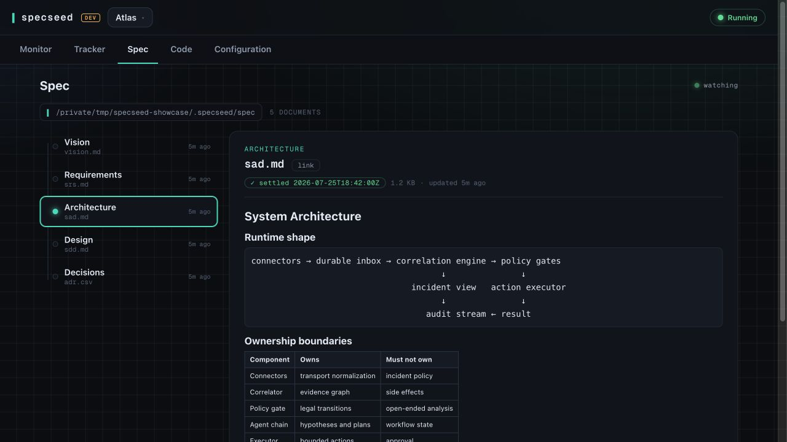

<div align="center">

# specseed

**Turn a repository, a tracker, and a chain of coding agents into one controlled delivery loop.**

Headless orchestration for specifications, implementation, review, approvals, recovery, and merge.

[Quick start](#quick-start) · [How it works](#how-it-works) · [Safety model](#safety-model) · [License](#license)

</div>

---

specseed watches work where it already lives, decides the next legal transition in code, and sends
one bounded job to the right agent. Agents propose and execute work. The runtime owns state,
permissions, retries, approvals, and merge gates.

It can run against its built-in local tracker, GitHub Issues, or GitLab Issues. One control plane
manages many repositories; each repository keeps an isolated runner and work queue.

<p align="center">
  
</p>
<p align="center"><sub>One live control plane. Separate deterministic and agent-work lanes.</sub></p>

## Why it exists

Coding agents are good at open-ended work. They are poor workflow engines.

specseed keeps the creative part agentic and makes the control plane deterministic:

- **Specs become executable plans.** Adopt an existing repository or shape a new idea into
  structured architecture, requirements, decisions, and dependency-aware work.
- **Work moves through explicit state machines.** Implementation, review, approval, readiness, and
  merge are separate transitions.
- **Humans approve consequences, not prompts.** Spec changes stage first. Merge approvals bind to a
  specific, current gate.
- **Failures become work.** Retries use durable backoff. Exhausted or actionable failures surface as
  tracker posts with their own investigation thread.
- **Agents are replaceable.** Configure ordered Claude Code and Codex chains per role, with fallback
  models and effort levels.
- **State survives the process.** SQLite queues, remote sync, heartbeat files, and idempotent
  transitions make restarts ordinary.

## How it works



Two lanes keep orchestration responsive: the control lane handles fast, deterministic state changes;
the work lane serializes expensive agent and git operations. Remote tracker state remains authoritative.

### A typical run

1. For a greenfield project, add `spec-change:adapt` to a tracker post.
2. The spec worker reads the repository and stages a spec plus work breakdown.
3. specseed posts the proposal. Nothing changes live before approval.
4. Approval promotes the spec and creates linked epics, tickets, and issues.
5. Ready issues move through implementation and optional review.
6. Dependencies hold downstream work until upstream code reaches the primary branch.
7. Merge gates are prepared against current primary before asking for approval.
8. Failures retry, surface context, and recover without losing the original thread.

For a non-greenfield project with existing code but no spec, start with `spec-change:adopt` instead.

<p align="center">
  
</p>
<p align="center"><sub>Reviewed, ready against current primary, then presented for a revision-bound decision.</sub></p>

## Control plane

The web UI and CLI expose the same model:

| Surface | What it controls |
|---|---|
| **Monitor** | Runner lifecycle, both queue lanes, live agent output, failures, retries, event log |
| **Tracker** | Local work board, spec-change requests, discussion, reactions, approval gates |
| **Spec** | Generated vision, requirements, architecture, design, and decisions |
| **Code** | Branches, history, committed trees, working tree, commits, and comparisons |
| **Configuration** | Agent chains, models, permissions, review threshold, recovery, remote behavior |

<p align="center">
  
</p>
<p align="center"><sub>Generated specifications stay inspectable beside the tracker and repository.</sub></p>

## Quick start

Requirements: macOS or Linux, Python 3, git, and at least one authenticated
[Claude Code](https://docs.anthropic.com/en/docs/claude-code) or
[Codex](https://developers.openai.com/codex/) CLI.

```bash
git clone https://github.com/dboun/specseed.git
cd specseed
./install.sh --both-platform-and-skill
```

Open a new shell, register a repository, then launch the control plane:

```bash
specseed add --target /path/to/repository --provider local
specseed
```

Start its runner from **Monitor**, or stay headless:

```bash
specseed start <repo>
specseed status <repo>
specseed pause <repo>
specseed resume <repo>
specseed stop <repo>
```

For GitHub or GitLab:

```bash
specseed add \
  --target /path/to/repository \
  --provider github \
  --repo owner/name \
  --token "$GITHUB_TOKEN"
```

Provider choice is final for a registered repository. Tokens and runtime state live under the
target's ignored `.specseed/` directory.

## Routes

| Route | Job |
|---|---|
| `spec` | Adopt, adapt, tweak, inject, or plan the next sprint |
| `implementation` | Implement one ready issue with tests |
| `review` | Review finished work and return a structured verdict |
| `ask` | Answer a repository, spec, or tracker question read-only |
| `merge_conflicts` | Resolve conflicts after readiness preparation |
| `resolve_platform_errors` | Investigate failed platform work and continue its thread |

Each role gets an ordered runner chain. A chain can mix provider, model, effort, and provider-specific
configuration. One failed agent can fall through to the next without changing workflow policy.

## Safety model

The runtime, not the model, owns consequential decisions.

- Action classes gate network, dependencies, containers, secrets, destructive data work, publishing,
  heavy compute, and writes outside the repository.
- Spec work is staged. Rejection leaves the live spec and tracker untouched.
- Approval applies to the latest gate comment. Reopened gates invalidate old reactions.
- Merge approval happens only after the branch is ready against current primary.
- A dependency is complete only when its code is on primary.
- Platform-authored comments are filtered to prevent self-trigger loops.
- Every runner is isolated per repository and can be paused or stopped out of band.

Defaults favor local work: publishing, remote pushes, primary merges, containers, dependency changes,
and destructive operations start blocked or human-gated.

## Design notes

- Python standard library only at runtime.
- Vanilla HTML, CSS, and JavaScript UI with no build step.
- SQLite-backed tracker cache and durable work queue.
- Poll-based remote sync; GitHub and GitLab remain the source of truth.
- Engine installs once. Target repositories receive only generated spec and runtime data.

Project is experimental. Interfaces and storage migrations still evolve.

## Development

```bash
# Control plane on the development port
src/specseed serve

# Unit suite
python3 -m pytest

# Opt-in integration suite
python3 -m pytest tests/integration/python/
```

Tests never invoke an agent or contact real GitHub/GitLab projects.

## License

specseed is source-available under the
[PolyForm Internal Use License 1.0.0](LICENSE.md). It permits organizations to use and modify
specseed for their own internal business operations. It does not permit distribution, sublicensing,
or transfer. Third-party components keep their original licenses.

## Acknowledgments

- [caveman](https://github.com/JuliusBrussee/caveman), MIT
- humanizer, MIT
- [Prism](https://github.com/PrismJS/prism), MIT
- [Geist Mono](https://fonts.google.com/specimen/Geist+Mono), SIL Open Font License 1.1
